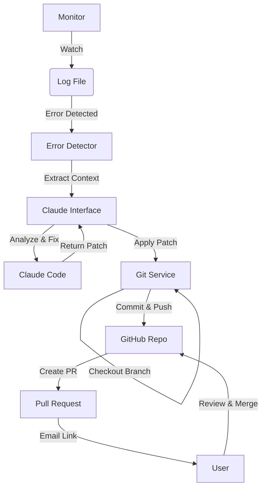

# AI 运维自动修复系统 (AI-Ops Auto-Repair System) 最终设计方案

## 1. 概述
本系统旨在构建一个智能化的运维故障自动响应平台。它实时监控应用程序日志，利用 Claude Code 的代码理解与生成能力分析错误，自动生成修复代码，并通过 GitHub Pull Request (GitOps) 的方式提交修复方案供人工审查与合并。

## 2. 核心价值
- **自动化**: 实现从发现错误到生成代码修复的全自动流程。
- **智能化**: 基于 Claude 对代码上下文的深度理解，提供精准修复，而非简单的重启。
- **GitOps**: 使用现代化的 PR 工作流，确保代码变更可审计、可回滚、人工可介入。
- **Human-in-the-Loop**: 最终决定权在人（Merge/Approve），既高效又安全。

## 3. 系统架构

### 3.1 模块划分

#### 1. 监控模块 (`log_monitor.py`)
- **功能**: 基于 `watchdog` 实时监听日志文件。
- **逻辑**: 只处理新增行，通过正则匹配 `ERROR`、`Exception` 等关键词。
- **上下文**: 捕获包含错误堆栈的完整日志段。

#### 2. AI 核心模块 (`claude_interface.py`)
- **功能**: 调用 Claude 分析错误。
- **交互**:
  - 提供错误信息 + 本地源代码（Claude 可通过工具读取）。
  - 要求 Claude 返回**单一最佳**修复方案。
  - **新特性**: 输出必须包含结构化的代码块或 Diff，以便机器自动应用。

#### 3. GitOps 服务 (`github_service.py`) [NEW]
- **功能**: 处理 Git 操作与 GitHub API 交互。
- **流程**:
  1. `git checkout -b fix/issue-<timestamp>`
  2. 应用 Claude 提供的修复代码（文件写入）。
  3. `git commit -m "fix(ai): auto-repair for <error>"`
  4. `git push origin fix/issue-<timestamp>`
  5. 调用 GitHub API 创建 PR。

#### 4. 通知模块 (`email_service.py`)
- **功能**: 发送邮件。
- **内容**: 包含错误的简介、Claude 的分析说明、以及 **GitHub PR 链接**。

## 4. 详细流程 (Happy Path)

1. **故障发生**: `app.py` 抛出 `ValueError`，日志写入 `app.log`。
2. **捕获**: `log_monitor.py` 在毫秒级内检测到，提取堆栈。
3. **分析**: 系统调用 `claude_interface.py`。
   - Claude 读取 `app.py` 源码。
   - Claude 生成修复后的 `process_data` 函数代码。
4. **提交**: `github_service.py` 启动。
   - 创建新分支 `fix/value-error-169871`。
   - 将 Claude 的代码回写到 `app.py`。
   - 提交并推送。
   - 创建 PR #42: "Fix ValueError in process_data"。
5. **触达**: 用户收到邮件 "AI 已创建修复 PR，请审查"。
6. **闭环**: 用户点击链接，在 GitHub 上查看 Diff，确认无误后点击 "Merge"。

## 5. 关键技术点

- **文件锁**: 在修改文件时需要考虑应用是否正在从该文件加载（热重载场景），但在开发辅助场景下通常可接受。
- **代码提取**: 提示词工程（Prompt Engineering）至关重要，必须让 Claude 输出非常干净的代码块，例如使用 `<code_block filename="app.py">...</code_block>` 格式。
- **安全性**: GitHub Token 必须配置在环境变量或 `config.py` 中，严禁硬编码。

## 6. 开发计划 (Roadmap)

- [x] Phase 1 (已完成): 基础框架（日志监控 -> Claude 分析 -> 邮件通知）。
- [ ] Phase 2 (进行中): GitOps 集成（实现 `github_service`，实现代码自动回写）。
- [ ] Phase 3 (未来规划):
  - 自动运行测试用例（`pytest`）验证修复有效性后再提交 PR。
  - Webhook 集成：监听 PR 评论，再次调用 Claude 修改代码（实现“对话式修代码”）。
  - 多语言支持与更复杂的错误去重。

## 7. 配置清单 (`config.py`)

- `SMTP_...`: 邮件服务配置。
- `GITHUB_TOKEN`: GitHub PAT。
- `GITHUB_REPO`: 目标仓库 (如 `username/ai-ops`)。
- `LOG_FILE_PATH`: 监控目标。
